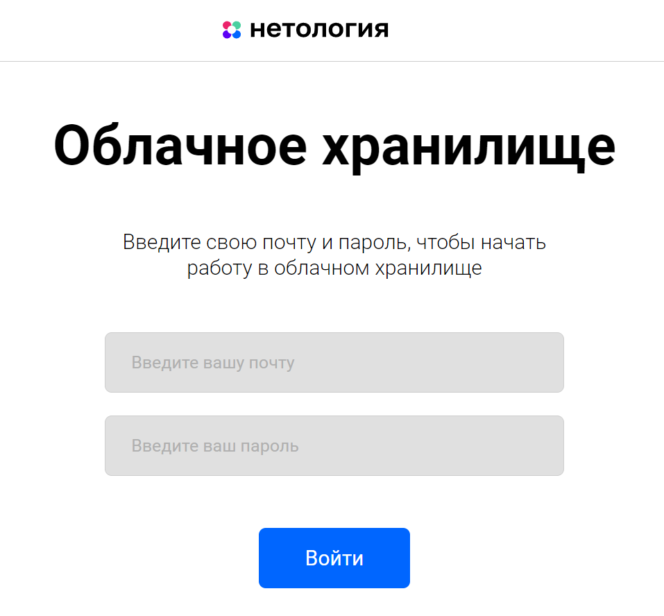

# [Дипломная работа “Облачное хранилище”](https://github.com/Sam1549/NetologyDiplom)

## Описание проекта

* REST-сервис предоставляет интерфейс для возможности загрузки файлов и вывода списка уже загруженных файлов пользователя.

* Все запросы к сервису должны быть авторизованы.

Заранее подготовленное веб-приложение (FRONT) подключается к разработанному сервису без доработок,
а также использует функционал FRONT для авторизации, загрузки и вывода списка файлов пользователя.

Изначально **FRONT** доступен на порту **8080**, **BACKEND** - на порту **8081**.

## **Требования к приложению**
1. Сервис должен предоставлять REST-интерфейс для интеграции с FRONT.
2. Сервис должен реализовывать все методы, описанные в [**yaml-файле**](CloudServiceSpecification.yaml):

- Авторизация.
- Добавление файла.
- Вывод списка файлов.
- Редактирование имени файла.
- Удаление файла.
- Загрузка файла.

## Стартовые пользователи:

*USERNAME:* user@gmail.com *PASSWORD:* 100

*USERNAME:* admin@gmail.com *PASSWORD:* 100

## **Реализация:**

* Приложение разработано с использованием **Spring Boot**
* Авторизация с помощью **JWT-Token Authentication,
  Spring Security, CORS.**
* База данных - **PostgreSQL**
* Сборщик пакетов - **maven**
* Для запуска используется **docker, docker-compose**
* Логирование - **log4j2** Запись логов в файле **app.log**
* Протестирован с помощью **Postman**
* Unit тесты с использованием **Mockito**
* Интеграционные тесты с использованием **testcontainers**
* Информация о пользователях сервиса хранится в базе данных
* Информация о файлах пользователей сервиса хранится в базе данных

## Запуск приложения

### Запуск FRONT:

1. Установить nodejs (версия 18.18.0) на компьютер;
2. Скачать [FRONT](https://github.com/frepingod/netology-cloud-storage-front) (JavaScript);
3. Перейти в папку FRONT приложения и все команды для запуска выполнять из нее;
4. Следуя описанию README.md FRONT проекта запустить nodejs приложение (npm install...);
5. Для запуска FRONT приложения с расширенным логированием использовать команду: `npm run serve`.

### Запуск BACKEND:

Запустить `docker-compose.yml`.
Автоматически создадутся все необходимые в базе данных таблицы:
- users,
- files,
- roles,
- user_roles

## Стартовая страница:
Front приложение по адресу http://localhost:8080/ предоставляет интерфейс:

